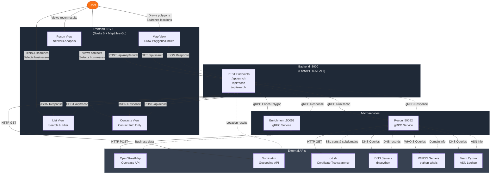

# Pointr

A geospatial data platform for discovering, analyzing, and investigating businesses and points of interest using interactive maps.

## Features

### Map View
- **Interactive Drawing**: Draw polygons and circles to define areas of interest
- **Business Discovery**: Automatically discover businesses, POIs, and government entities within drawn areas
- **Location Search**: Search for locations worldwide using OpenStreetMap Nominatim
- **Color-Coded Markers**: Visual categorization by business type (Food, Retail, Healthcare, Government, etc.)
- **Contact Badges**: Visual indicators showing which businesses have phone, email, or website data
- **Find in List**: Click any business marker to search for it in the list view

### List View
- **Full-Text Search**: Search across all business data fields
- **Category Filtering**: Filter by 9 business categories
- **Contact Filtering**: Filter by availability of phone, email, or website
- **Sorting**: Sort by any column (ascending/descending/none)
- **Pagination**: Navigate through large datasets
- **Selection**: Multi-select businesses for reconnaissance

### Contacts View
- **Pre-Filtered Data**: Shows only businesses with contact information
- **Quick Access**: Streamlined view of phone numbers, emails, and websites
- **Selection Sync**: Selection state synchronized with List View

### Recon View
- **Network Reconnaissance**: Run network analysis on selected business websites
- **DNS Records**: Query A, AAAA, MX, TXT, NS records
- **SSL Certificates**: Certificate details from Certificate Transparency logs
- **Subdomain Discovery**: Automated subdomain enumeration via crt.sh
- **Security Headers**: HTTP security header analysis
- **WHOIS Data**: Domain registration information
- **ASN Information**: Autonomous system and IP range data
- **All Free Tools**: No API keys required

## Architecture



**Data Flow:**

1. **Map Enrichment**: User draws polygon → Frontend → Backend REST → Enrichment gRPC → OSM Overpass → Business data returned
2. **Reconnaissance**: User selects businesses → Frontend → Backend REST → Recon gRPC → Free network tools → Recon data returned
3. **Location Search**: User searches → Frontend → Backend REST → Nominatim API → Location results returned

## Project Structure

```
leadmaker/
├── proto/                # Protocol Buffer definitions
│   ├── enrichment.proto  # Map enrichment service
│   └── recon.proto       # Network recon service
├── backend/              # FastAPI REST API
│   ├── main.py
│   ├── enrichment_pb2*.py
│   ├── recon_pb2*.py
│   ├── pyproject.toml
│   └── Dockerfile
├── enrichment/           # gRPC enrichment service
│   ├── main.py
│   ├── requirements.txt
│   └── Dockerfile
├── recon/                # gRPC recon service
│   ├── main.py
│   ├── requirements.txt
│   └── Dockerfile
├── frontend/             # Svelte 5 + MapLibre UI
│   ├── src/
│   │   ├── lib/
│   │   │   ├── Map.svelte
│   │   │   ├── ListView.svelte
│   │   │   ├── ContactsView.svelte
│   │   │   ├── ReconView.svelte
│   │   │   └── components/
│   │   │       └── DataTable/
│   │   ├── App.svelte
│   │   └── main.js
│   ├── Dockerfile
│   └── package.json
├── docker-compose.yml    # Docker orchestration
└── README.md
```

## Prerequisites

### Option 1: Docker (Recommended)
- Docker
- Docker Compose

### Option 2: Local Development
- Python 3.14+
- Node.js (v20+ recommended)
- uv (Python package manager)

## Development

### With Docker (Recommended)

The easiest way to run the entire stack with hot reloading:

```bash
docker compose up
```

This will start all services:
- Frontend: `http://localhost:5173`
- Backend API: `http://localhost:8000`
- Enrichment gRPC: `localhost:50051`
- Recon gRPC: `localhost:50052`

All services support hot reloading - changes to your code will automatically reload.

To rebuild after dependency changes:

```bash
docker compose up --build
```

To stop the services:

```bash
docker compose down
```

### Local Development (Alternative)

#### Setup

Backend dependencies:

```bash
cd backend
uv sync
```

Enrichment service:

```bash
cd enrichment
pip install -r requirements.txt
```

Recon service:

```bash
cd recon
pip install -r requirements.txt
```

Frontend dependencies:

```bash
cd frontend
npm install
```

#### Running Services

You'll need to run 4 terminals:

**Terminal 1** (Backend):
```bash
cd backend
uv run python main.py
```

**Terminal 2** (Enrichment):
```bash
cd enrichment
python main.py
```

**Terminal 3** (Recon):
```bash
cd recon
python main.py
```

**Terminal 4** (Frontend):
```bash
cd frontend
npm run dev
```

## API Documentation

FastAPI provides automatic API documentation at:
- Swagger UI: `http://localhost:8000/docs`
- ReDoc: `http://localhost:8000/redoc`

### REST API Endpoints (Backend)

**General**
- `GET /` - Welcome message
- `GET /api/health` - Health check

**Map Enrichment**
- `POST /api/enrich` - Enrich polygon data (legacy endpoint)
- `POST /api/map/enrich` - Enrich polygon with business/POI data
  - Input: `{ coordinates: [{ lat, lng }] }`
  - Output: Area, population, businesses with contact info

**Network Reconnaissance**
- `POST /api/recon` - Run network recon on domains
  - Input: `{ domains: ["example.com", "example.org"] }`
  - Output: DNS, SSL, subdomains, security headers, WHOIS, ASN data

**Location Search**
- `GET /api/search?q={query}` - Search for locations
  - Input: Query string (min 3 characters)
  - Output: Location results from Nominatim

### gRPC Services

**Enrichment Service (port 50051)**
- `EnrichPolygon(PolygonRequest) -> EnrichmentResponse`
  - Queries OpenStreetMap Overpass API
  - Returns businesses with contact information

**Recon Service (port 50052)**
- `RunRecon(ReconRequest) -> ReconResponse`
  - DNS lookups via dnspython
  - SSL certificates from crt.sh
  - Subdomain enumeration from Certificate Transparency
  - Security header checks via HTTP requests
  - WHOIS lookups
  - ASN data from Team Cymru

## Tech Stack

### Backend (REST API)
- FastAPI - Modern Python web framework
- Uvicorn - ASGI server
- Pydantic - Data validation
- gRPC - RPC client for microservices
- httpx - Async HTTP client

### Enrichment Service (gRPC)
- gRPC - High-performance RPC framework
- Protocol Buffers - Interface definition
- Shapely - Geometric calculations
- requests - HTTP client for Overpass API

### Recon Service (gRPC)
- gRPC - High-performance RPC framework
- Protocol Buffers - Interface definition
- dnspython - DNS queries
- python-whois - WHOIS lookups
- httpx - HTTP client for crt.sh and security headers

### Frontend
- Svelte 5 - Reactive UI framework with runes (`$state`, `$derived`, `$effect`)
- Vite - Build tool and dev server
- Tailwind CSS v4 - Utility-first CSS framework
- MapLibre GL JS - WebGL-based interactive maps
- Mapbox GL Draw - Polygon and circle drawing tools
- Turf.js - Geospatial analysis
- Custom DataTable - Reusable table component with search, filtering, sorting, pagination

## Business Categories

The application categorizes businesses into 9 types:

1. **Food & Dining** - Restaurants, cafes, bars, fast food
2. **Retail & Shopping** - Stores, shops, malls, markets
3. **Healthcare** - Hospitals, clinics, pharmacies, doctors
4. **Education** - Schools, universities, libraries, kindergartens
5. **Professional Services** - Lawyers, accountants, consultants, real estate
6. **Entertainment** - Cinemas, theaters, museums, parks
7. **Government & Public** - Government offices, embassies, post offices, police, fire stations
8. **Transportation** - Airports, train stations, bus stops, parking
9. **Other** - Everything else

## Free Reconnaissance Tools

The recon service uses only free tools with no API key requirements:

- **DNS Records**: dnspython library (queries public DNS servers)
- **SSL Certificates**: crt.sh API (Certificate Transparency logs)
- **Subdomains**: Extracted from SSL certificate Subject Alternative Names
- **Security Headers**: Direct HTTP HEAD requests
- **WHOIS**: python-whois library (queries public WHOIS servers)
- **ASN Information**: Team Cymru DNS-based ASN lookup service

## License

MIT
