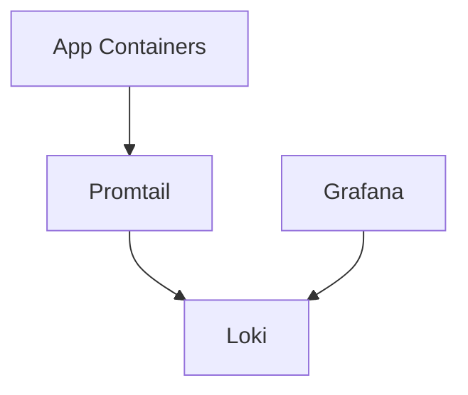

# Logging (Grafana + Loki)

This project ships with a self-hosted logging stack using Grafana + Loki + Promtail.

## Services

- **Grafana**: http://localhost:3000 (admin/admin)
- **Loki**: http://localhost:3100
- **Promtail**: http://localhost:9080 (metrics/status), scrapes Docker container logs and ships them to Loki

## How It Works



Promtail discovers Docker containers and forwards their logs to Loki. Grafana is pre-provisioned with Loki as the default datasource.

Grafana also provisions a basic “Docker Logs” dashboard with:
- Log volume by container
- Log stream filtered by container

## Quick Start

```bash
docker compose up --build
```

## Example Queries

- All logs: `{job="docker"}`
- Single container (by id): `{job="docker", container_id="..."}`

## Files

- `logging/loki-config.yml`
- `logging/promtail-config.yml`
- `logging/grafana/provisioning/datasources/loki.yml`
- `logging/grafana/provisioning/dashboards/dashboards.yml`
- `logging/grafana/dashboards/docker-logs.json`

If you want structured JSON logs with user identifiers, I can wire that in next.
